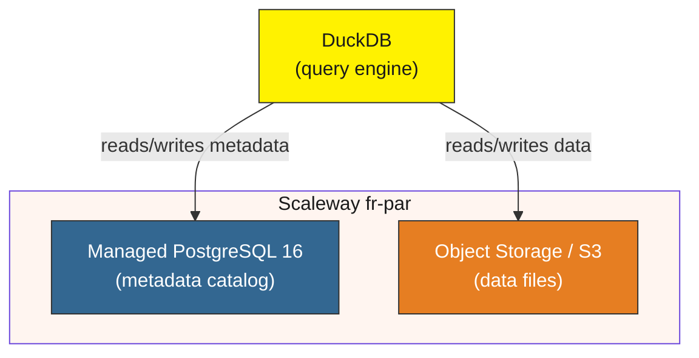

# DuckLake on Scaleway

Deploy a [DuckLake](https://ducklake.select/) data lakehouse on Scaleway for around €20/month (using 1 TB of object storage).

This uses Scaleway's fully managed database and S3 services, reducing the need for operational overhead.

## Architecture



## Prerequisites

- [Terraform](https://www.terraform.io/downloads) >= 1.3.0
- A [Scaleway account](https://console.scaleway.com/register)
- Scaleway IAM API key (access key + secret key)

## Get Scaleway API credentials

1. Log in to the [Scaleway Console](https://console.scaleway.com)
2. Go to [IAM → API Keys](https://console.scaleway.com/iam/api-keys)
3. Click **Generate API Key**, fill in a description, and confirm
4. Copy both the **Access Key** (`SCW...`) and the **Secret Key**. The secret is shown only once.
5. Find your **Project ID** under [Project → Settings](https://console.scaleway.com/project/settings)

## Setup

### 1. Configure environment variables

Copy the sample and fill in your values:

```bash
cp .env.sample .env
# edit .env with your values
source .env
```

### 2. Initialize Terraform

```bash
cd terraform
terraform init
```

### 3. Apply

```bash
terraform plan
terraform apply
```

### 4. Connect DuckDB to DuckLake

```bash
duckdb -init ../init.sql
```

> `data/outputs.json` is written automatically by Terraform during `apply`.

### 5. Query data

```sql
CREATE TABLE flights AS
    SELECT * FROM 'https://duckdb.org/data/flights.csv';

SELECT * FROM flights LIMIT 10;
```

## Environment variables

All configuration is driven by environment variables (see [.env.sample](.env.sample)).

| Variable | Description |
|---|---|
| `SCW_ACCESS_KEY` | Scaleway IAM access key (read natively by the provider) |
| `SCW_SECRET_KEY` | Scaleway IAM secret key (read natively by the provider) |
| `SCW_DEFAULT_PROJECT_ID` | Scaleway project UUID (read natively by the provider) |
| `TF_VAR_postgres_db_password` | Password for the `ducklake` DB user |
| `TF_VAR_s3_bucket_name` | Object Storage bucket name (globally unique) |
| `TF_VAR_region` | Scaleway region (default: `fr-par`) |

These variables are also emitted as Terraform outputs and read directly by `init.sql` to configure DuckDB's S3 connection.

## Cost

Costs scale with storage usage. The smallest PostgreSQL instance (DB-DEV-S) costs ~€12.38/month; object storage is ~€7,7/TB/month (Mar, 18, 2026). See the official pricing pages:

- [Managed Databases](https://www.scaleway.com/en/pricing/managed-databases/)
- [Object Storage](https://www.scaleway.com/en/pricing/storage/)

## Restricting database access

The `scaleway_rdb_acl` resource in [terraform/scaleway.tf](terraform/scaleway.tf) controls which IPs can reach the PostgreSQL public endpoint. By default this repo allows `0.0.0.0/0` (all IPs) for convenience. For production use, restrict this to your actual IPs:

```hcl
resource "scaleway_rdb_acl" "ducklake" {
  instance_id = scaleway_rdb_instance.ducklake.id
  region      = "fr-par"

  acl_rules {
    ip          = "203.0.113.42/32"  # your IP
    description = "My workstation"
  }
}
```

You can add multiple `acl_rules` blocks. Removing the `0.0.0.0/0` rule means only listed IPs can connect. Everything else is dropped at the network level before reaching PostgreSQL.

## Destroying the infrastructure

```bash
terraform destroy
```

> The object storage bucket will fail to destroy if it contains objects. [Empty the bucket](https://console.scaleway.com/object-storage/buckets/) first, or add `force_destroy = true` to `scaleway_object_bucket` before running destroy.
